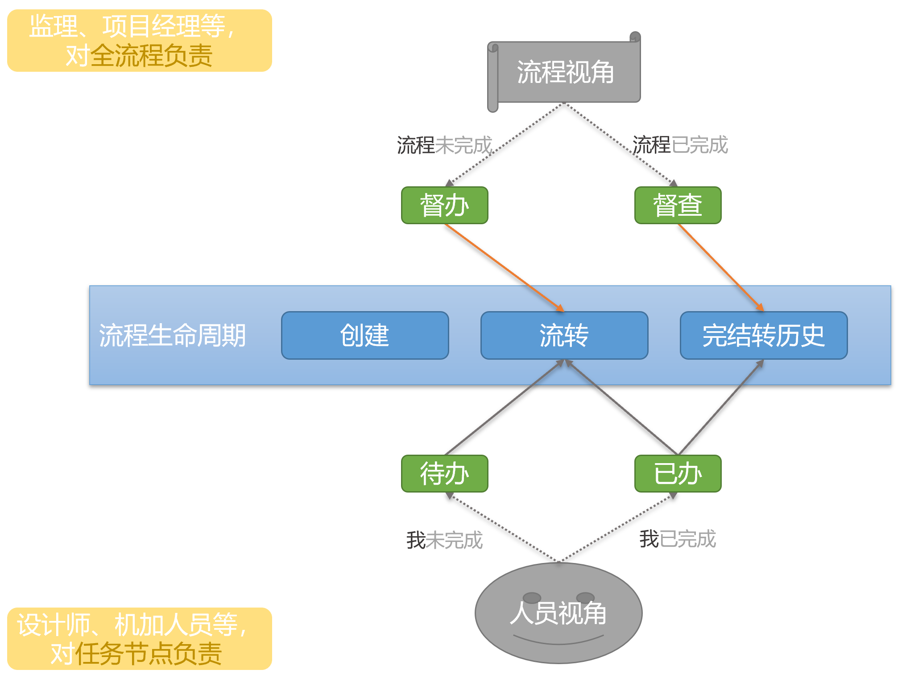
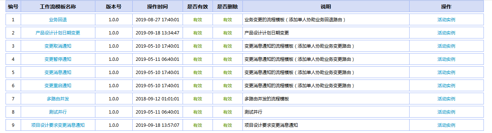
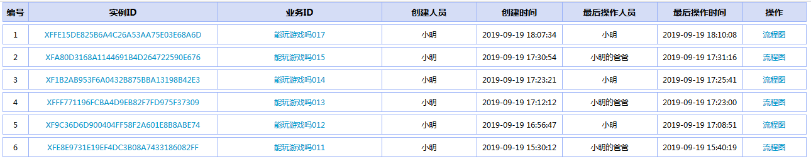
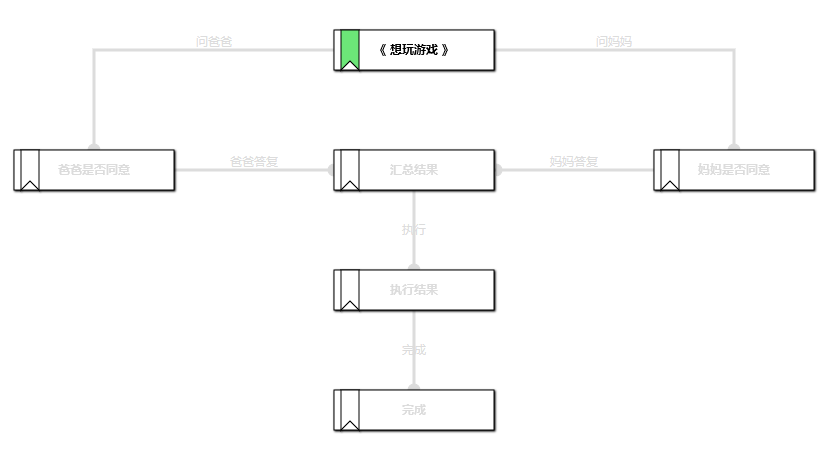
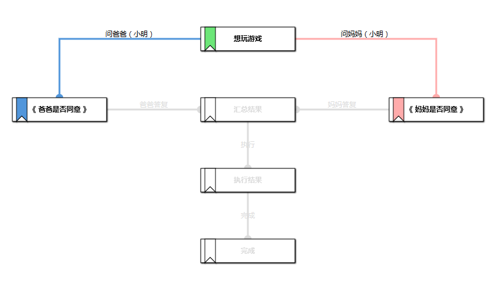
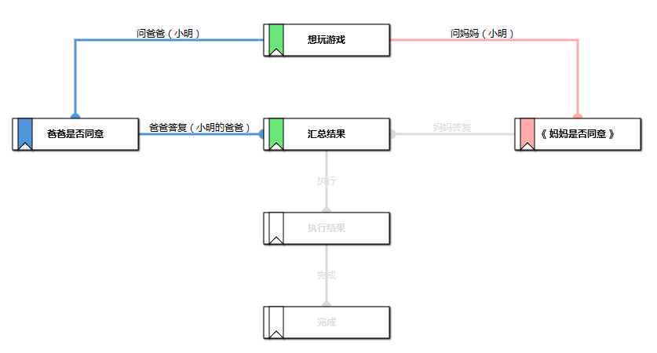
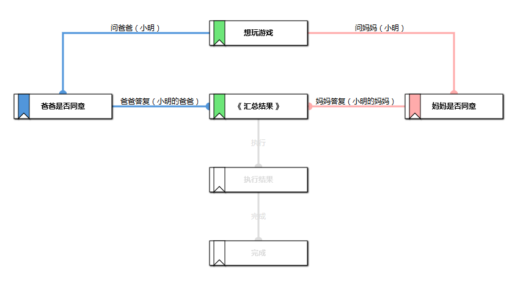
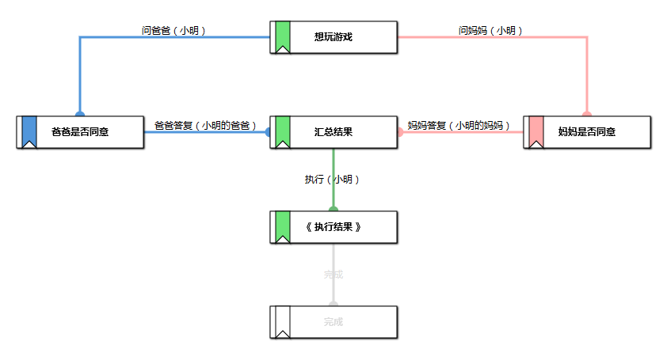
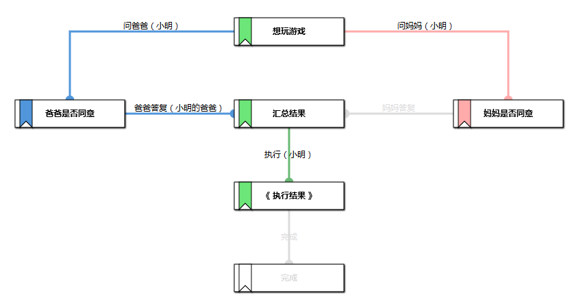
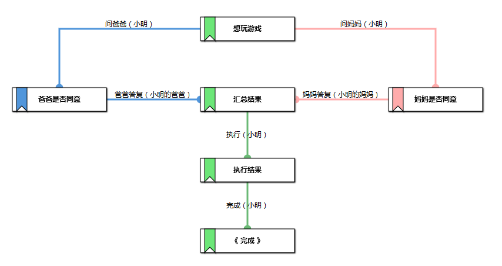

# XFlowWeb

生命周期（待办、已办、督办、督查）
------
待办：要做什么
已办：做过什么
督办：监督、协同他人正在做的。抄送一次，流程完结前全流程随时可查
督查：复查督办全流程已完结的

工作流系统
------

访问工作流系统 http://127.0.0.1/XFlowWeb/analyses

流程模板列表

实例列表（活动的）

创建实例
------

多路并行
------

一方已同意，其它方还在考虑
------

单方授权通过，其它方不用再授权
------

多方均答复才能通过
------

多方汇总结果后执行
------

单方授权通过，汇总结果后执行
------

完成
------

---
#### 本项目引用Jar包，其源码链接如下
引用 https://github.com/HY-ZhengWei/XFlowEngine 类库

引用 https://github.com/HY-ZhengWei/XFlowEngineClient 类库

引用 https://github.com/HY-ZhengWei/hy.common.base 类库

引用 https://github.com/HY-ZhengWei/hy.common.db 类库

引用 https://github.com/HY-ZhengWei/hy.common.file 类库

引用 https://github.com/HY-ZhengWei/hy.common.net 类库

引用 https://github.com/HY-ZhengWei/hy.common.tpool 类库

引用 https://github.com/HY-ZhengWei/XJava 类库